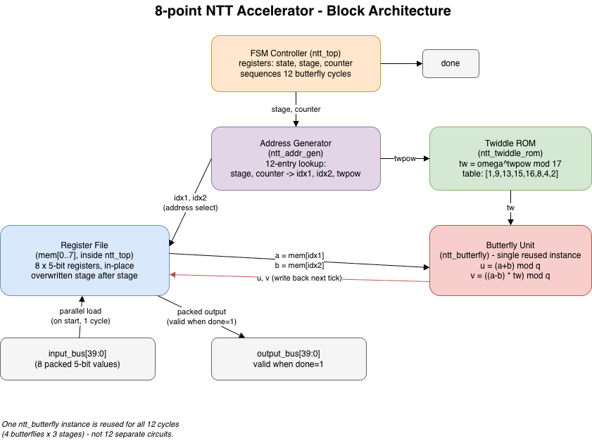
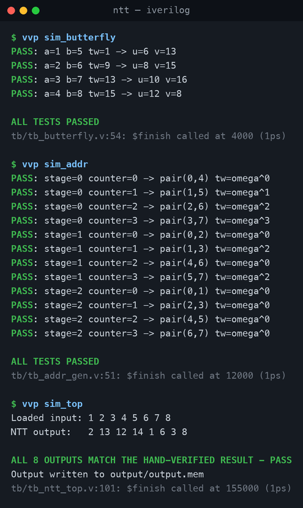

# 8-point Number Theoretic Transform (NTT) Accelerator

An iterative, single-butterfly-unit hardware implementation of an 8-point
NTT in Verilog, with parameters n=8, q=17, omega=9 (a hand-verified and
computationally-verified primitive 8th root of unity mod 17).

Built and verified with [Icarus Verilog](http://iverilog.icarus.com/)
(open-source, no proprietary tools required).

## Architecture



## Repository layout

```
.
├── README.md              - this file
├── docs/
│   └── ntt-architecture.png  - block diagram (above)
├── rtl/
│   ├── ntt_butterfly.v      - the single reusable butterfly datapath
│   │                          (modular add / subtract / multiply-reduce)
│   ├── ntt_twiddle_rom.v    - precomputed twiddle factor table
│   │                          (omega^0..omega^7 mod 17)
│   ├── ntt_addr_gen.v       - lookup of which two memory positions and
│   │                          which twiddle power each of the 12
│   │                          butterflies needs
│   └── ntt_top.v            - FSM + register file + top-level wiring
├── tb/
│   ├── tb_butterfly.v       - standalone test of the butterfly unit alone
│   ├── tb_addr_gen.v        - standalone test of the address generator
│   │                          alone
│   └── tb_ntt_top.v         - full-system test: loads input from a file,
│                              runs the whole design, checks the output,
│                              writes the result to a file
├── input/
│   └── input.mem            - test vector [1,2,3,4,5,6,7,8] as 5-bit
│                              binary, one value per line
└── output/
    └── output.mem            - sample output from a passing run, for
                                 reference (regenerated each time the
                                 testbench runs)
```

## How to run

Requires [Icarus Verilog](http://iverilog.icarus.com/) — no proprietary
EDA tools, no license server.

| Platform | Install command |
| --- | --- |
| macOS (Homebrew) | `brew install icarus-verilog` |
| Debian / Ubuntu | `sudo apt-get install iverilog` |
| Fedora | `sudo dnf install iverilog` |
| Windows | [download the installer](https://bleyer.org/icarus/) |

Verify the install with `iverilog -V`.

Run all commands from the repository root, so the testbench's relative
file paths (`input/input.mem`, `output/output.mem`) resolve correctly.

```bash
# Butterfly unit alone
iverilog -o sim_butterfly rtl/ntt_butterfly.v tb/tb_butterfly.v
vvp sim_butterfly

# Address generator alone
iverilog -o sim_addr rtl/ntt_addr_gen.v tb/tb_addr_gen.v
vvp sim_addr

# Full system
iverilog -o sim_top rtl/ntt_butterfly.v rtl/ntt_twiddle_rom.v rtl/ntt_addr_gen.v rtl/ntt_top.v tb/tb_ntt_top.v
vvp sim_top
```

### Results



Butterfly unit (`vvp sim_butterfly`):

```
PASS: a=1 b=5 tw=1  -> u=6  v=13
PASS: a=2 b=6 tw=9  -> u=8  v=15
PASS: a=3 b=7 tw=13 -> u=10 v=16
PASS: a=4 b=8 tw=15 -> u=12 v=8

ALL TESTS PASSED
```

Address generator (`vvp sim_addr`) — all 12 butterflies across 3 stages:

```
PASS: stage=0 counter=0 -> pair(0,4) tw=omega^0
PASS: stage=0 counter=1 -> pair(1,5) tw=omega^1
PASS: stage=0 counter=2 -> pair(2,6) tw=omega^2
PASS: stage=0 counter=3 -> pair(3,7) tw=omega^3
PASS: stage=1 counter=0 -> pair(0,2) tw=omega^0
PASS: stage=1 counter=1 -> pair(1,3) tw=omega^2
PASS: stage=1 counter=2 -> pair(4,6) tw=omega^0
PASS: stage=1 counter=3 -> pair(5,7) tw=omega^2
PASS: stage=2 counter=0 -> pair(0,1) tw=omega^0
PASS: stage=2 counter=1 -> pair(2,3) tw=omega^0
PASS: stage=2 counter=2 -> pair(4,5) tw=omega^0
PASS: stage=2 counter=3 -> pair(6,7) tw=omega^0

ALL TESTS PASSED
```

Full system (`vvp sim_top`) for input [1,2,3,4,5,6,7,8]:

```
Loaded input: 1 2 3 4 5 6 7 8
NTT output:   2 13 12 14 1 6 3 8

ALL 8 OUTPUTS MATCH THE HAND-VERIFIED RESULT - PASS
Output written to output/output.mem
```

This result was independently verified by hand (working through every
butterfly of all 3 stages with the mod-17 arithmetic explicit at each
step) and cross-checked against a separate Python software reference
model before any Verilog was written.

Compiled simulation binaries (`sim_butterfly`, `sim_addr`, `sim_top`) are
gitignored - regenerate them with the commands above rather than
expecting them in the repo.

## Architecture overview

See the [block diagram](docs/ntt-architecture.png) above.

- **Single reused butterfly unit.** Rather than instantiating 12
  separate butterfly circuits (4 per stage x 3 stages), there is exactly
  one `ntt_butterfly` instance. The FSM in `ntt_top` feeds it different
  operands and a different twiddle factor every clock cycle, so the
  whole 8-point NTT completes in 12 cycles (plus 1 to load), reusing the
  same hardware throughout.

- **In-place register file.** The 8 working values live in one 5-bit x 8
  register array (`mem` inside `ntt_top`), overwritten in place stage
  after stage - no separate storage is needed for intermediate results.

- **ROM-based twiddle storage.** All 8 possible twiddle values
  (omega^0..omega^7 mod 17) are precomputed once and stored in a small
  lookup ROM (`ntt_twiddle_rom`), rather than computed at runtime.

- **Hardcoded address generation.** `ntt_addr_gen` is a fixed 12-entry
  lookup table enumerating exactly the (position-pair, twiddle-power)
  combinations needed across the 3 stages for n=8. This is a deliberate
  simplicity choice for a fixed, small n - see "Design decisions and
  trade-offs" below for how this would change for larger n.

- **Modular arithmetic.** The adder and subtractor use a single
  conditional correction (add/subtract q once), which is provably
  sufficient since operands never exceed 16. The multiplier uses
  behavioral `%` reduction, since a single correction isn't enough after
  a multiply (the raw product can reach up to 256).

## Design decisions and trade-offs

1. **Hardcoded vs. computed addressing.** The address generator is a
   12-entry lookup table rather than real divide/modulo hardware. This
   is simple and exhaustively verifiable for a fixed n=8, but doesn't
   generalize: supporting n=16 or n=32 would require real arithmetic
   address generation using `twiddle_power = i * (n / block_size)`
   (verified against the software reference model during development).
   Because block sizes in this algorithm are always powers of two, that
   generalization would only need bit-shifts, not real division - so
   it's a cheap upgrade path, not a fundamental redesign.

2. **Behavioral modular multiplication.** Using Verilog's `%` operator
   for the multiplier's reduction step is only reasonable because q=17
   is tiny. For a cryptographically-sized prime, this would need to be
   replaced with a real reduction circuit (Barrett or Montgomery
   reduction are the standard choices).

3. **One-cycle-per-butterfly, fully sequential.** This design
   prioritizes minimal hardware (one butterfly unit total) over speed
   (12+1 cycles for 8 points). A pipelined design, or one with multiple
   parallel butterfly units, would trade more area for lower latency.

4. **Parallel input load.** All 8 inputs load in a single cycle via a
   packed 40-bit bus, rather than serially through a narrower port.

## Verification strategy

Each piece was tested in isolation before integration:

1. `ntt_butterfly` checked against all 4 hand-verified stage-1 pairs
   (`tb/tb_butterfly.v`).
2. `ntt_addr_gen` checked against all 12 hand-derived (pair, twiddle)
   combinations across all 3 stages (`tb/tb_addr_gen.v`).
3. The full `ntt_top` system checked end-to-end against the complete
   hand-verified NTT output, with the input loaded from a text file and
   the output written back to one (`tb/tb_ntt_top.v`).

## Future work

- **Inverse NTT (INTT).** Same datapath with inverse twiddles
  (omega^-1 mod 17) plus a final multiply by n^-1 mod q.
- **Larger transform sizes.** Replace the hardcoded address table with
  arithmetic address generation (`twiddle_power = i * (n / block_size)`,
  bit-shifts only) so n=16/32/... come for free.
- **Real modular reduction.** Swap behavioral `%` for Barrett or
  Montgomery reduction to support cryptographically-sized q.
- **Pipelining / parallel butterflies.** Trade area for latency by
  instantiating multiple butterfly units or pipelining the multiplier.
